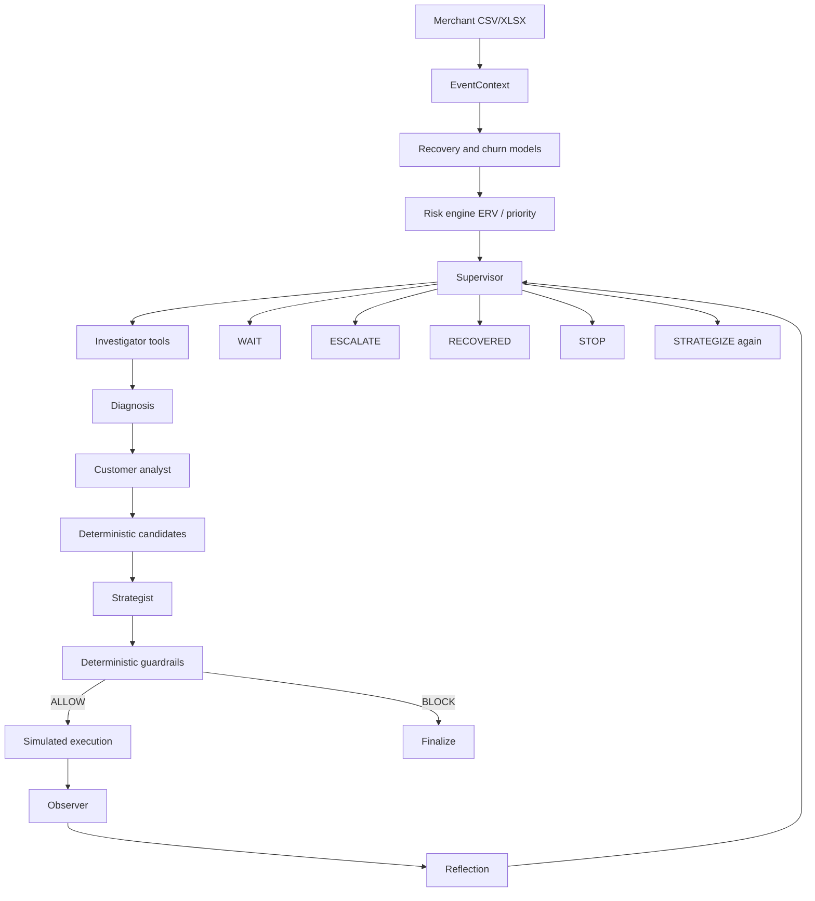

# Agentic AI architecture

RevenueOS is a **buildathon-ready agentic MVP with production-evolvable architecture**.
Payment and messaging tools are simulated. This is not a production payment platform.

## End-to-end flow

## Responsibilities

| Layer | Answers |
|---|---|
| ML | What is likely? `P(recovery)`, `P(churn)` |
| Risk engine | How much is the opportunity worth? ERV, priority |
| Supervisor | What stage is needed next? |
| Investigator | What do the tools show? |
| Diagnosis | What is the likely cause? |
| Customer analyst | How should we treat this customer? Does not rewrite ML churn. |
| Strategist | Which **eligible** candidate should we try? |
| Guardrails | Is that action legal **right now**? Code is the authority. |
| Execution | Simulated tool result |
| Observer | What happened in this simulation? |
| Reflection | Continue, wait, escalate, stop, or recovered? |

## Runtime modes

- `AGENT_MODE=ollama` — local Ollama (`llama3.2:3b` by default)
- `AGENT_MODE=openai_compatible` — OpenAI-compatible HTTP API
- `AGENT_MODE=deterministic_fallback` — no LLM
- `AGENT_MODE=auto` — OpenAI-compatible if `LLM_API_KEY` is set, otherwise **deterministic fallback**. Auto does **not** attach Ollama (so default tests and CI never call a local model). Use `AGENT_MODE=ollama` for Llama 3.2 3B.

If the LLM is missing, times out, or returns invalid JSON, the graph continues with deterministic fallback. The API stays healthy. The UI must show fallback honestly.

## Memory

- **Workflow memory:** LangGraph state + `iteration_history` + `agent_trace`, persisted under `artifacts/workflows/{event_id}/`
- **Outcome memory:** existing outcome intelligence. Agents may read learning signals with `n >= 5`. Not causal. Not RAG.

## Invariants

- Unknown / invented actions never execute
- `BLOCK` ⇒ zero tool execution
- Dataset labels are never treated as observed agent outcomes
- No chain-of-thought is stored
- Revenue at risk ≠ predicted recoverable value (ERV) ≠ actual recovered amount
- Not every event is pursued; low ERV / low probability can select `stop_recovery` (NO_ACTION)

## Recoverability

A deterministic classifier (`classify_recoverability`) uses existing recovery probability, ERV, event status, attempts, cooldown/max-intervention policy signals, and customer activity. It does not retrain models or replace guardrails. Closed events and cooldown/max-attempt cases still go through guardrails (BLOCK). Economic no-action uses `stop_recovery`.

## Ask Recovery Copilot (read-only)

One shared Copilot service (`POST /api/v1/copilot/ask`) explains a **selected event_id**. It is not a chatbot per event and not a second agent graph.

- Loads grounded context from existing event detail + latest workflow artifacts for that ID only
- Uses the same Ollama / Llama provider and deterministic fallback conventions as the agent
- Cannot execute tools, mutate workflows, or change policy
