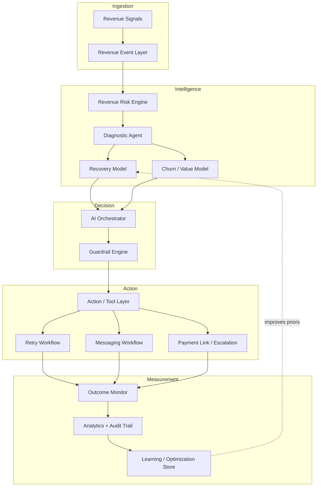
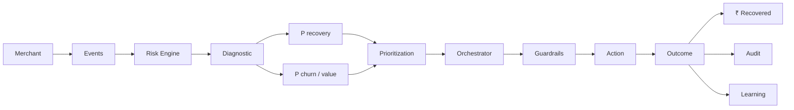
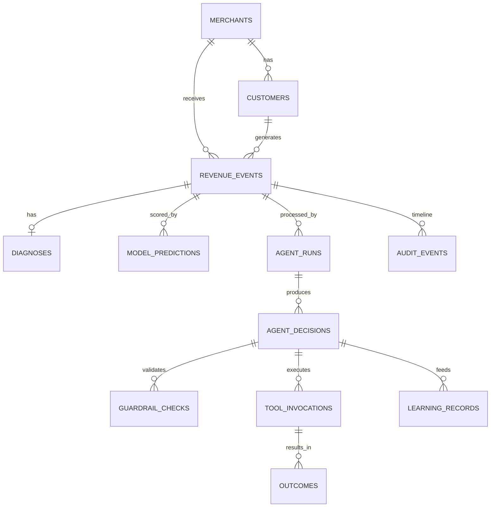
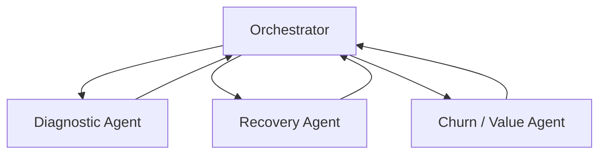
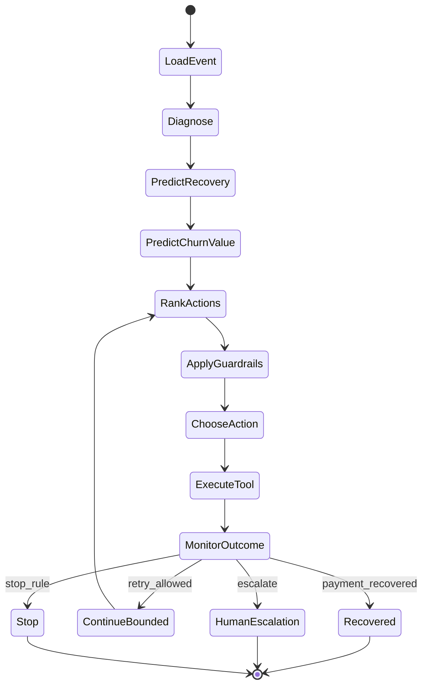

# PROJECT.md — Revenue Recovery Orchestrator

> Architecture reference and product blueprint for RevenueOS.
>
> Read this before making architectural or product changes.
>
> **Last updated:** 2026-09-03

---

## Table of Contents

1. [Document Purpose](#1-document-purpose)
2. [Project Identity](#2-project-identity)
3. [Problem Statement](#3-problem-statement)
4. [Product Definition](#4-product-definition)
5. [Core Product Thesis](#5-core-product-thesis)
6. [Differentiation Strategy](#6-differentiation-strategy)
7. [Primary Users & Jobs-to-be-Done](#7-primary-users--jobs-to-be-done)
8. [Revenue-at-Risk Sources](#8-revenue-at-risk-sources)
9. [High-Level System Architecture](#9-high-level-system-architecture)
10. [Component Specifications](#10-component-specifications)
11. [Data Model & Database](#11-data-model--database)
12. [Revenue Event Schema](#12-revenue-event-schema)
13. [ML Models](#13-ml-models)
14. [LLM Role & Boundaries](#14-llm-role--boundaries)
15. [Agents](#15-agents)
16. [AI Orchestrator (LangGraph)](#16-ai-orchestrator-langgraph)
17. [Action / Tool Layer](#17-action--tool-layer)
18. [Guardrail Engine](#18-guardrail-engine)
19. [Outcome Monitoring & Measurement](#19-outcome-monitoring--measurement)
20. [Learning / Optimization](#20-learning--optimization)
21. [Audit Trail](#21-audit-trail)
22. [Synthetic Data Strategy](#22-synthetic-data-strategy)
23. [Backend Responsibilities](#23-backend-responsibilities)
24. [API Design](#24-api-design)
25. [Frontend / Merchant Dashboard](#25-frontend--merchant-dashboard)
26. [Demo Scenario](#26-demo-scenario)
27. [MVP Scope](#27-mvp-scope)
28. [Explicitly Out of Scope](#28-explicitly-out-of-scope)
29. [Technology Stack](#29-technology-stack)
30. [Project Structure](#30-project-structure)
31. [Architectural Principles](#31-architectural-principles)
32. [Agent State Contract](#32-agent-state-contract)
33. [Development Philosophy & Sequence](#33-development-philosophy--sequence)
34. [Engineering Rules](#34-engineering-rules)
35. [Testing Strategy](#35-testing-strategy)
36. [Evaluation Metrics](#36-evaluation-metrics)
37. [Security & Privacy](#37-security--privacy)
38. [Observability](#38-observability)
39. [Failure Handling](#39-failure-handling)
40. [Human-in-the-Loop](#40-human-in-the-loop)
41. [Future Roadmap](#41-future-roadmap)
42. [Assumptions](#42-assumptions)
43. [Unresolved / TBD Decisions](#43-unresolved--tbd-decisions)
44. [What This Document Is / Is Not](#44-what-this-document-is--is-not)
45. [Change Control](#45-change-control)

---

## 1. Document Purpose

`PROJECT.md` is the **permanent source of truth** for:

| Concern | Guidance location |
|---|---|
| What the product is | §2–§6 |
| Who uses it | §7 |
| How the system works | §9–§21 |
| What to build in MVP | §27–§28 |
| How to build it | §29–§35 |
| How AI agents must behave | §34 |
| What comes later | §41 |

Whenever there is uncertainty about architecture, feature scope, agent responsibilities, technology, data flow, or product direction, **consult this document first**.

If implementation materially changes the architecture, **this file must be updated in the same change set**.

**This step creates documentation only.** No application code is authorized by this document alone; implementation proceeds in later phases per §33.

---

## 2. Project Identity

| Field | Value |
|---|---|
| **Working name** | Revenue Recovery Orchestrator |
| **Repo / workspace** | RevenueOS |
| **Context** | Razorpay AI Buildathon — **AI Revenue Recovery** track |
| **Product type** | Merchant-facing AI revenue intelligence + bounded autonomous recovery orchestration |
| **Primary optimization target** | Expected recoverable revenue and **actual recovered revenue (₹)** |
| **Non-goal** | Maximizing recovery attempt volume, message count, or retry count |

### One-line definition

An autonomous intelligence/orchestration layer that identifies revenue at risk across the revenue lifecycle, estimates what is realistically recoverable, prioritizes opportunities, selects optimal bounded interventions, executes them through controlled tools, monitors outcomes, and measures money recovered.

### Elevator thesis

> Build an autonomous Revenue Recovery Orchestrator that identifies revenue at risk across the revenue lifecycle, estimates what revenue is realistically recoverable, prioritizes opportunities, determines the optimal bounded intervention, executes the intervention through controlled tools/workflows, monitors the outcome, and measures actual money recovered.

---

## 3. Problem Statement

### What merchants experience

Merchants lose revenue from **multiple, concurrent leakage points**:

- payment failures (bank declines, insufficient funds, auth failures, timeouts)
- checkout abandonment after purchase intent
- subscription / mandate failures on recurring payments

Today these are often handled by **specialized, siloed workflows**:

```text
Subscription failure  → subscription recovery agent
Checkout abandonment  → cart recovery agent
Payment failure       → retry / recovery workflow
```

That model has structural gaps:

1. **No portfolio view** — “Of everything currently at risk, what should we act on first?”
2. **Amount-biased prioritization** — largest transaction ≠ highest expected recovery
3. **Weak recoverability estimation** — effort spent on low-probability recoveries
4. **Transaction-only thinking** — ignores churn / future revenue at risk
5. **Unbounded friction** — endless retries and contacts without stop rules
6. **Activity metrics over economic outcomes** — “50,000 messages sent” ≠ success
7. **Incomplete auditability** — hard to answer why an action was chosen and what ₹ was recovered

### What this project solves

A unified layer that answers:

> “Out of all the revenue currently at risk, what should the merchant try to recover first, why, how should it be recovered, when should the system stop, and how much money did we actually recover?”

---

## 4. Product Definition

### Working definition — Revenue Recovery Orchestrator

A merchant-facing AI-powered revenue intelligence and recovery system that continuously:

1. analyzes revenue-at-risk events
2. prioritizes the most valuable recovery opportunities
3. reasons about customer and payment context
4. selects the best recovery workflow from an approved action set
5. executes bounded actions through approved tools
6. monitors outcomes
7. maintains a complete audit trail
8. feeds outcomes into learning / optimization

### What this product is NOT

| Not this | Why |
|---|---|
| Another payment retry system | Retries are one tool, not the product |
| Another subscription recovery agent | We orchestrate above specialized workflows |
| Another abandoned-cart recovery system | Checkout is one signal among many |
| A chatbot | Messaging is a tool; the product is orchestration + economics |
| A dashboard-only product | UI visualizes decisions; intelligence lives in backend/agents/ML |
| An LLM wrapper | LLM reasons; ML predicts; backend enforces; tools act |

### Positioning relative to Razorpay capabilities

Razorpay already offers (or is building) specialized capabilities such as Subscription Recovery Agent, Abandoned Cart Conversion Agent, payment retry workflows, Agent Studio, and other AI financial workflows.

**This project differentiates by operating as an intelligence/orchestration layer across multiple revenue-loss signals**, not by replacing any single specialized agent.

---

## 5. Core Product Thesis

### Wrong model

```text
Payment failed
    ↓
Retry payment
```

### Correct model

```text
Revenue Signals
      ↓
Revenue Risk Detection
      ↓
Opportunity Evaluation
      ↓
Expected Recovery Estimation
      ↓
Customer / Business Context
      ↓
Recovery + Churn/Value Intelligence
      ↓
AI Decision / Orchestration
      ↓
Bounded Intervention
      ↓
Outcome Monitoring
      ↓
Actual ₹ Recovered
      ↓
Learning / Optimization
```

### Decision stack the system must think in

```text
Revenue At Risk
        ↓
Recoverability
        ↓
Expected Recovery Value
        ↓
Customer Value / Churn
        ↓
Intervention Cost / Friction
        ↓
Best Action
```

### Core economic insight (must remain visible in product & demo)

Recovering the **current transaction** is not the same as protecting **future revenue**.

| Example | Value |
|---|---|
| Current failed payment | ₹999 |
| Future revenue at risk (CLV / remaining subscription value) | ₹24,000 |

A ₹999 failure with high churn risk may justify retention-oriented intervention; a ₹999 failure with near-zero recoverability may justify **stop**.

### Success definition

Success is **not**:

> “We sent 50,000 recovery messages.”

Success **is**:

> “We recovered ₹X with Y interventions.”

The system optimizes for **economic outcome**, not activity volume.

---

## 6. Differentiation Strategy

### Existing specialized model

```text
Specific problem
    ↓
Specific recovery workflow
```

### Our model

```text
Multiple revenue-loss signals
        ↓
Unified revenue intelligence
        ↓
Expected recovery estimation
        ↓
Portfolio prioritization
        ↓
Best bounded intervention
        ↓
Measured economic outcome
```

### Conceptual placement above specialized workflows

```text
                 ALL REVENUE SIGNALS
                         ↓
               REVENUE RISK ENGINE
                         ↓
             "WHERE SHOULD WE ACT?"
                         ↓
              EXPECTED RECOVERY VALUE
                         ↓
                 AI ORCHESTRATOR
                         ↓
       ┌─────────────────┼──────────────────┐
       ↓                 ↓                  ↓
 Subscription        Checkout           Payment
 Recovery            Recovery            Recovery
 Workflow            Workflow            Workflow
       ↓                 ↓                  ↓
       └─────────────────┼──────────────────┘
                         ↓
                  OUTCOME MONITOR
                         ↓
                  ₹ ACTUALLY RECOVERED
```

### Core differentiator (one sentence)

> **Revenue orchestration and prioritization across multiple recovery opportunities** — not merely smarter retries.

---

## 7. Primary Users & Jobs-to-be-Done

### Primary user: Merchant

Examples of merchant segments (MVP synthetic + demo):

- SaaS businesses
- Subscription businesses
- E-commerce businesses
- Digital services
- Businesses using recurring payments
- Businesses with large transaction volumes

### Merchant jobs

| Job | System response |
|---|---|
| Understand how much revenue is at risk | Overview metrics: Revenue At Risk |
| Know what is realistically recoverable | Expected Recoverable Revenue |
| Prioritize opportunities | Priority score + opportunity list |
| Understand why revenue is being lost | Diagnostic agent + audit trail |
| Allow AI to execute recovery | Orchestrator + tool layer (simulated in MVP) |
| Avoid unnecessary friction | Guardrails + stop rules |
| Avoid endless retry/contact | Contact/retry limits + stop/escalate |
| Recover more revenue | Optimize for ₹ recovered |
| Reduce customer churn | Churn/value agent + retention actions |
| Measure actual recovery performance | Outcome monitor + analytics |

### Secondary users (MVP-light)

| User | Role in MVP |
|---|---|
| Human operator / support | Approves escalations; reviews high-value cases |
| Demo presenter / judge | Consumes dashboard + audit trail narrative |

**Status: TBD** — whether multi-merchant login / RBAC is needed for demo vs single demo merchant.

---

## 8. Revenue-at-Risk Sources

### MVP primary sources (must support)

#### A. Payment Failure

Examples:

- insufficient funds
- bank decline
- card decline
- temporary bank downtime
- timeout
- authentication failure
- payment method issue

#### B. Checkout Abandonment

Customer enters checkout, shows purchase intent, does not complete payment. System decides whether recovery intervention is worthwhile.

#### C. Subscription / Mandate Failure

Examples:

- recurring payment failure
- mandate failure
- expired payment method
- insufficient funds on recurring charge
- recurring payment decline

### Future sources (NOT MVP)

- B2B overdue receivables
- promise-to-pay
- invoice recovery
- payment disputes
- other merchant-specific leakage

Architecture should be **event-type extensible**, but future sources must not be implemented in MVP without explicit approval.

---

## 9. High-Level System Architecture

### Architecture diagram

```text
                    REVENUE SIGNALS
                         │
                         ▼
              ┌─────────────────────┐
              │ Revenue Event Layer │
              └──────────┬──────────┘
                         │
                         ▼
              ┌─────────────────────┐
              │ Revenue Risk Engine │
              │                     │
              │ Risk / Priority /   │
              │ Expected Recovery   │
              └──────────┬──────────┘
                         │
                         ▼
              ┌─────────────────────┐
              │ Diagnostic Agent    │
              └──────────┬──────────┘
                         │
             ┌───────────┴────────────┐
             │                        │
             ▼                        ▼
    ┌─────────────────┐      ┌─────────────────┐
    │ Recovery Model   │      │ Churn / Value   │
    │                 │      │ Model           │
    └────────┬────────┘      └────────┬────────┘
             │                        │
             └───────────┬────────────┘
                         │
                         ▼
              ┌─────────────────────┐
              │ AI Orchestrator     │
              │ / Decision Engine   │
              └──────────┬──────────┘
                         │
                         ▼
              ┌─────────────────────┐
              │ Guardrail Engine    │
              └──────────┬──────────┘
                         │
                         ▼
              ┌─────────────────────┐
              │ Action / Tool Layer │
              └──────────┬──────────┘
                         │
             ┌───────────┼──────────────┐
             ▼           ▼              ▼
         Retry       Messaging     Payment Link
         Workflow    Workflow      / Escalation
             │           │              │
             └───────────┼──────────────┘
                         │
                         ▼
              ┌─────────────────────┐
              │ Outcome Monitor     │
              └──────────┬──────────┘
                         │
                         ▼
              ┌─────────────────────┐
              │ Recovery Analytics   │
              │ + Audit Trail        │
              └──────────┬──────────┘
                         │
                         ▼
              ┌─────────────────────┐
              │ Learning /           │
              │ Optimization Store   │
              └─────────────────────┘
```

### Mermaid — system context



### Mermaid — end-to-end data / control flow



### Component responsibility map (summary)

| Component | Responsibility | Primary I/O |
|---|---|---|
| Revenue Event Layer | Normalize heterogeneous signals | Raw signal → canonical event |
| Revenue Risk Engine | Score / prioritize opportunities | Event → expected recovery + priority |
| Diagnostic Agent | Explain / classify situation | Event + history → structured diagnosis |
| Recovery Model | Estimate P(recovery \| context, action) | Features → probability |
| Churn / Value Model | Estimate churn + CLV / future ₹ at risk | Features → churn_p + value |
| AI Orchestrator | Coordinate decide/act loop | AgentState → selected action |
| Guardrail Engine | Enforce hard constraints | Proposed action → allow/deny/modify |
| Action / Tool Layer | Execute approved tools | Tool call → structured result |
| Outcome Monitor | Observe post-action results | Action → outcome record |
| Analytics + Audit | Merchant-visible truth | Queries → metrics / timeline |
| Learning Store | Persist (context, action, outcome) | Outcomes → training / policy updates |

---

## 10. Component Specifications

Every component below has: purpose, inputs, outputs, dependencies, failure behavior.

---

### 10.1 Revenue Event Layer

**Purpose:** Ingestion and normalization. Convert heterogeneous revenue-loss signals into a stable internal event contract.

**Inputs:**

- payment failure webhooks / simulated payloads
- checkout abandonment events
- subscription / mandate failure events
- enrichment context (customer, merchant, history) when available

**Outputs:**

- canonical `RevenueEvent` records persisted in DB
- optional enrichment flags (`needs_enrichment`, `schema_version`)

**Dependencies:** schemas, database, (later) webhook auth

**Failure behavior:**

- reject malformed events with structured validation errors
- never silently drop events without a dead-letter / error log entry
- partial enrichment allowed; missing optional fields must be explicit nulls, not invented values

---

### 10.2 Revenue Risk Engine

**Purpose:** Determine which revenue-at-risk opportunities deserve intervention effort. Answers: *“Where should the system spend recovery effort?”*

**Must not** simply rank by transaction amount.

**Consider at minimum:**

- amount
- recovery probability
- customer value
- churn probability
- historical payment behavior
- urgency
- intervention cost
- customer friction
- merchant policy
- previous attempts
- event type

#### Conceptual framework (not a frozen formula)

```text
Expected Recovery Value (ERV)
=
Revenue At Risk
×
Probability of Recovery
```

Richer prioritization score (conceptual):

```text
Priority Score =
Expected Recovery Value
+ Customer Lifetime Value Impact
- Intervention Cost
- Friction Penalty
- Risk / Policy Penalty
```

> Do **not** hard-code this exact mathematical formula as immutable law. Experimentation may replace weights or structure. Document and version any production formula. Treat the above as the **conceptual framework**.

**Inputs:** canonical event + customer/merchant features + model scores (when available)

**Outputs:**

- `revenue_at_risk`
- `expected_recovery_value`
- `priority_score`
- `priority_band` (e.g., critical / high / medium / low / skip)
- scoring explanation fields for audit

**Dependencies:** recovery model (or prior), churn/value model (or prior), merchant policy config

**Failure behavior:**

- if models unavailable, fall back to deterministic heuristic scoring (documented policy)
- never invent probabilities via LLM

---

### 10.3 Diagnostic Agent

**Purpose:** Understand the event and produce machine-readable diagnosis for downstream agents.

**Responsibilities:**

1. inspect the revenue event
2. inspect customer history
3. inspect merchant context
4. inspect previous recovery attempts
5. understand failure reason
6. classify the situation
7. identify recoverability band
8. generate structured reasoning
9. produce machine-readable output

**Example output (illustrative):**

```json
{
  "event_type": "subscription_failure",
  "root_cause": "insufficient_funds",
  "recoverability": "high",
  "recovery_probability": 0.72,
  "churn_risk": 0.64,
  "customer_value": 24000,
  "recommended_priority": "high",
  "reasoning_summary": "Temporary liquidity pattern; prior successful recoveries after delayed retry; elevated churn if unresolved."
}
```

**Critical rule:** The LLM must **not** invent numerical probabilities. Numerical predictions come from ML models or deterministic calculations. The Diagnostic Agent may *interpret* and *structure* those numbers; it may not fabricate them.

**Inputs:** event, customer, merchant, attempt history, model scores  
**Outputs:** structured `Diagnosis` object attached to AgentState  
**Dependencies:** LLM (optional for narrative), models (required for numbers), DB  
**Failure behavior:** if LLM fails, emit diagnosis from deterministic classifier + model scores only

---

### 10.4 Recovery Model (ML)

See §13.1.

---

### 10.5 Churn / Value Model (ML)

See §13.2.

---

### 10.6 AI Orchestrator / Decision Engine

See §16.

---

### 10.7 Guardrail Engine

See §18.

---

### 10.8 Action / Tool Layer

See §17.

---

### 10.9 Outcome Monitor

See §19.

---

### 10.10 Recovery Analytics + Audit Trail

See §21 and §25.

---

### 10.11 Learning / Optimization Store

See §20.

---

## 11. Data Model & Database

### Database choice

| Layer | Choice |
|---|---|
| Primary store | **PostgreSQL** |
| ORM | SQLAlchemy |
| Validation | Pydantic schemas at API boundary |

### Core entities (conceptual)

| Entity | Purpose |
|---|---|
| `merchants` | Merchant profile + policy settings |
| `customers` | Synthetic customer profiles & behavioral features |
| `revenue_events` | Canonical revenue-at-risk events |
| `recovery_opportunities` | Scored/prioritized view or derived table |
| `diagnoses` | Structured diagnostic outputs |
| `model_predictions` | Versioned recovery/churn/value predictions |
| `agent_runs` | Orchestrator executions |
| `agent_decisions` | Chosen actions + reasons |
| `guardrail_checks` | Per-decision guardrail results |
| `actions` / `tool_invocations` | Executed tools with I/O |
| `outcomes` | Observed results + ₹ recovered |
| `audit_events` | Append-only timeline entries |
| `learning_records` | (context, action, outcome) tuples |
| `simulation_runs` | Batch simulation metadata |

### Relationships (conceptual)



**Status: TBD** — exact table names, indexes, and whether `recovery_opportunities` is a materialized view vs table.

---

## 12. Revenue Event Schema

Every ingested signal becomes a standardized internal representation.

### Minimum conceptual fields

| Field | Meaning |
|---|---|
| `event_id` | Stable unique identifier |
| `event_type` | `payment_failure` \| `checkout_abandonment` \| `subscription_failure` \| … |
| `merchant_id` | Owning merchant |
| `customer_id` | Customer reference |
| `transaction_id` | Related payment/txn if applicable |
| `subscription_id` | Related subscription/mandate if applicable |
| `amount` | Revenue at risk for this event |
| `currency` | e.g., `INR` |
| `timestamp` | Event occurrence time |
| `payment_method` | card / UPI / netbanking / wallet / etc. |
| `failure_reason` | Normalized reason code |
| `attempt_number` | nth payment/recovery attempt context |
| `status` | lifecycle status of the event |
| `customer_tenure` | tenure feature snapshot |
| `historical_success_rate` | customer payment success prior |
| `historical_failure_count` | prior failure count |
| `previous_recovery_attempts` | count/list of prior recovery actions |
| `customer_activity` | engagement / usage snapshot |
| `merchant_context` | segment / policy snapshot |
| `metadata` | extensible bag for event-specific fields |

### Design rules

- Conceptual contract remains stable even if physical columns evolve.
- Prefer normalized `failure_reason` enums over free text in scoring paths.
- Snapshot features onto the event at analysis time so audits remain reproducible.
- Do not store real PII in MVP; synthetic identities only (§38).

### Example event status lifecycle (conceptual)

```text
received → scored → diagnosed → action_pending → action_executed → recovered | failed | stopped | escalated | expired
```

**Status: TBD** — final enum set for `status` and `failure_reason`.

---

## 13. ML Models

### Separation principle

```text
ML  → prediction (numbers)
LLM → reasoning / interpretation / orchestration (not inventing probabilities)
```

---

### 13.1 Recovery Model

**Estimates:**

```text
P(payment/revenue recovered | context, action)
```

**Target use:** action ranking and ERV calculation.

**Candidate features (eventual):**

- event type
- failure reason
- amount
- customer tenure
- payment method
- historical payment success
- previous failures
- previous recovery outcomes
- time since failure
- customer activity
- merchant segment
- candidate action

**Initial algorithms considered:** Logistic Regression, Random Forest, XGBoost

**Preferred initial model: XGBoost**

| Reason | Detail |
|---|---|
| Data shape | Tabular, structured synthetic features |
| Performance | Strong baseline for heterogeneous tabular features |
| Practicality | Relatively easy to train/evaluate |
| Interpretability | Feature importance usable in audits/demos |
| Fit | Good match for correlated synthetic data |

**Do not over-engineer.** No deep learning for MVP unless a later decision explicitly overrides this.

**Outputs:**

- `recovery_probability` (0–1)
- optional `recovery_probability_by_action` map
- `model_version`
- feature snapshot reference

**Training data:** synthetic labeled outcomes from generator + simulation (§22).

**Failure behavior:** if model artifact missing, use deterministic heuristic probability tables keyed by `(event_type, failure_reason, action)`.

---

### 13.2 Churn / Customer Value Model

**Estimates:**

```text
P(customer churns | customer context)
```

**Also produce:**

```text
churn_probability
customer_lifetime_value_estimate
future_revenue_at_risk
```

**Candidate features:**

- customer tenure
- payment failures
- delayed payments
- usage frequency
- recent activity
- support interactions
- previous recovery history
- subscription history
- payment frequency
- engagement trend

**Core product demonstration:**

| Signal | Example |
|---|---|
| Current failed payment | ₹999 |
| Future revenue at risk | ₹24,000 |

This justifies retention-oriented actions when churn risk and CLV are high — even if the immediate amount is modest.

**Preferred initial approach:** XGBoost or calibrated logistic regression for churn probability; CLV / future revenue via rule-based or regression estimate on synthetic subscription economics.

**Status: TBD** — whether CLV is a second supervised model or a deterministic remaining-value calculator in MVP.

**Failure behavior:** fallback to tenure × average recurring amount heuristics; mark predictions as `fallback=true` in audit.

---

## 14. LLM Role & Boundaries

### LLM is used for

- interpreting event context into structured diagnosis narratives
- comparing candidate actions with merchant policy language
- producing human-readable reasons for the dashboard/audit
- orchestration glue inside LangGraph nodes (structured tool calling)

### LLM is NOT used for

- inventing recovery/churn probabilities
- inventing unavailable tools/actions
- direct unrestricted database writes
- silent policy override
- inventing monetary outcomes

### Preferred pattern

```text
Deterministic + ML numbers
        ↓
LLM structures reasoning around those numbers
        ↓
Backend validates schema
        ↓
Guardrails enforce constraints
        ↓
Tools execute
```

### Structured tool calling

Agents may only call tools from the approved registry (§17). Invalid tool names/args are rejected by the tool layer, not “creatively fixed” into unsafe behavior.

---

## 15. Agents

Agents are modular. Each has a narrow responsibility. They share `AgentState` (§32), not unstructured chat history as source of truth.



---

### 15.1 Diagnostic Agent

Covered in §10.3.

**Output contract:** machine-readable diagnosis + optional natural-language summary.

---

### 15.2 Recovery Agent (AI Recovery Agent)

**Purpose:** Select the best recovery workflow from the approved action set.

**Approved candidate actions (MVP):**

```text
retry_now
retry_later
generate_payment_link
send_email
send_whatsapp
send_hinglish_message
request_payment_method_update
offer_retention_incentive
schedule_followup
escalate_to_human
stop_recovery
```

**Hard rule:** Choose only from approved actions. Never invent arbitrary actions.

**Decision considerations:**

- recovery probability by action
- customer value
- churn probability
- previous attempts
- merchant policy
- intervention friction
- stopping rules

**Inputs:** diagnosis, model scores, candidate action utilities, policies  
**Outputs:** ranked candidates + recommended action + reason  
**Failure behavior:** default to conservative deterministic policy (e.g., `retry_later` for temporary bank issues; `request_payment_method_update` for expired card; `stop_recovery` when ERV below threshold)

---

### 15.3 Churn / Value Agent

**Purpose:** Determine whether the customer represents **future revenue risk** and whether additional retention intervention is justified.

**Not** merely another recovery agent.

**Illustrative policy examples:**

| Customer | Context | Direction |
|---|---|---|
| A | Payment ₹999, churn 5% | Simple recovery |
| B | Payment ₹999, churn 82%, future value ₹25,000 | Recovery + retention |
| C | Payment ₹999, 5 previous failures, recovery prob 2% | Stop / escalate — do not keep contacting |

**Outputs:**

- `retention_justified: bool`
- `future_revenue_at_risk`
- `recommended_retention_actions` (subset of approved actions)
- `stop_or_escalate_recommendation` when recoverability is futile

---

### 15.4 Orchestrator Agent

See §16 — the Orchestrator is the coordinating graph, not a free-form chat agent.

---

## 16. AI Orchestrator (LangGraph)

### Role

Coordinates:

- diagnostic output
- recovery model scores
- churn/value model scores
- customer value
- merchant policies
- available tools
- guardrails
- action selection
- outcome recording

### Preferred implementation

**LangGraph** with explicit state transitions.

### Conceptual flow

```text
START
 ↓
Load Event
 ↓
Diagnose
 ↓
Predict Recovery
 ↓
Predict Churn / Value
 ↓
Rank Candidate Actions
 ↓
Apply Guardrails
 ↓
Choose Action
 ↓
Execute Tool
 ↓
Monitor Outcome
 ↓
Recovered?
 ├── YES → Record Success → END
 ├── NO + retry allowed → Continue bounded workflow
 ├── NO + escalation needed → Human Escalation
 └── NO + stop rule → STOP
```

### Mermaid — orchestrator state machine



### Orchestrator rules

1. State is structured (`AgentState`), not chat transcript.
2. Numbers come from models/heuristics before reasoning nodes.
3. Guardrails run **before** tool execution.
4. Every transition emits audit events.
5. Loops are bounded by attempt counters and stop rules.
6. On LLM failure, fall back to deterministic policy path without halting the pipeline silently.

---

## 17. Action / Tool Layer

Agents interact with the outside world **only** through controlled tools.

### MVP tools (simulated but real interfaces)

| Tool | Intent |
|---|---|
| `retry_payment()` | Immediate payment retry |
| `schedule_retry()` | Delayed retry |
| `generate_payment_link()` | Create recoverable payment link |
| `send_email()` | Email outreach |
| `send_whatsapp()` | WhatsApp outreach |
| `send_hinglish_message()` | Localized/Hinglish outreach |
| `offer_retention_incentive()` | Bounded discount / retention offer |
| `request_payment_method_update()` | Ask customer to update method |
| `escalate_to_human()` | Hand off to human queue |
| `stop_recovery()` | Explicit termination |

### Simulation requirements (mandatory)

Even when simulated, tools must:

- accept structured inputs
- return structured outputs
- create action / tool invocation records
- update event state
- produce timestamps
- produce success/failure (or pending) outcomes

**Do not fake everything inside the LLM response.** Tool execution is backend code.

### Tool I/O pattern (conceptual)

```text
ToolRequest { tool_name, args, event_id, agent_run_id }
        ↓
Validate args + permissions + guardrails already passed
        ↓
Execute (simulate)
        ↓
ToolResult { ok, result_code, payload, timestamp }
        ↓
Persist + emit audit
```

---

## 18. Guardrail Engine

**Mandatory.** Agents operate within explicit constraints. All guardrail decisions are logged.

### Example guardrails

| Guardrail | Rule intent |
|---|---|
| Contact frequency | Do not contact a customer more than X times within Y hours |
| Retry limit | Do not retry beyond configured limits |
| Discount limit | Do not offer incentives above merchant-approved thresholds |
| High-value escalation | Amount above threshold → human review |
| Low-value stop | If ERV < intervention cost → stop |
| Repeated failure stop | After N failed attempts → stop or escalate |
| Consent / channel | Only approved channels and merchant-approved messaging |
| Action allowlist | Reject unknown actions |

### Decision outcomes

```text
allow | deny | require_human_approval | modify (e.g., reduce discount)
```

### Inputs / outputs

**Inputs:** proposed action, event, customer contact history, merchant policy  
**Outputs:** `GuardrailResult` with per-check status and final disposition  
**Failure behavior:** fail closed (deny / escalate) if policy config cannot be loaded

### Default MVP policy knobs (illustrative; configurable)

| Knob | Example default | Status |
|---|---|---|
| Max contacts / 24h | 2 | TBD finalize |
| Max payment retries / event | 3 | TBD finalize |
| Max discount % | 10% | TBD finalize |
| High-value threshold | ₹25,000 | TBD finalize |
| Min ERV to intervene | ₹50 or cost model | TBD finalize |

---

## 19. Outcome Monitoring & Measurement

After an action executes, the system observes and stores outcomes.

### Possible outcomes

```text
payment_recovered
payment_failed
customer_clicked
customer_ignored
customer_churned
customer_retained
action_expired
human_escalated
```

### Stored fields (minimum)

| Field | Meaning |
|---|---|
| `action_id` | Tool invocation / action id |
| `event_id` | Related revenue event |
| `action_type` | Which tool/action |
| `timestamp` | When observed |
| `result` | Outcome enum |
| `amount_recovered` | ₹ actually recovered (0 if none) |
| `time_to_recovery` | Latency from event or action |
| `customer_response` | Optional response class |

### How revenue recovery is calculated

| Metric | Definition |
|---|---|
| **Revenue At Risk** | Sum of `amount` for open/at-risk events in scope |
| **Expected Recoverable Revenue** | Sum of `ERV = amount × P(recovery)` (or richer ERV) over prioritized actionable set |
| **Actual Revenue Recovered** | Sum of `amount_recovered` from outcomes with `payment_recovered` (and equivalent success codes) |
| **Recovery Rate** | `Actual Recovered / Revenue At Risk` **or** `Actual Recovered / Expected Recoverable` — **must be labeled explicitly in UI** |

**Status: TBD** — primary dashboard “Recovery Rate” denominator (at-risk vs expected-recoverable). Demo copy currently uses recovered / expected style (~69.6% in sample narrative); finalize before UI lock.

### Decision → action → money loop

```text
Decision made
 → Tool executed
 → Outcome observed
 → amount_recovered posted
 → Metrics + audit updated
 → Learning record written
```

---

## 20. Learning / Optimization

### MVP stance

**Do NOT implement complex reinforcement learning** in the initial version.

### Build an outcome / learning store

Track at least:

```text
event_context
candidate_actions
chosen_action
outcome
amount_recovered
time_to_recovery
```

### Adaptive demonstration goal

System should be capable of showing:

> “For customers with this context, action X historically performs better than action Y.”

Mechanism options for MVP:

1. retrain recovery model periodically on accumulated outcomes
2. simple empirical win-rate tables by segment × action
3. both (preferred long-term; start with (2) if time-constrained)

**Status: TBD** — automated retrain cadence vs manual offline retrain for demo.

---

## 21. Audit Trail

Every important AI decision must be traceable.

### Questions every event record must answer

1. What happened?
2. Why was it considered risky?
3. What did the models predict?
4. What did the agents recommend?
5. What action was selected?
6. Why was that action selected?
7. Which guardrails were checked?
8. What tool was called?
9. What happened afterward?
10. How much money was recovered?

### Example timeline

```text
10:42:01  Revenue event detected
10:42:02  Recovery probability = 0.72
10:42:02  Churn probability = 0.64
10:42:03  Expected recovery = ₹1,420
10:42:03  Selected: WhatsApp + payment link
10:42:03  Guardrails passed
10:42:04  Action executed
14:17:21  Payment recovered
          Recovered: ₹1,999
```

Auditability is essential for demo credibility, debugging, and human-in-the-loop trust.

---

## 22. Synthetic Data Strategy

Production Razorpay data is unavailable. The project **must** use realistic synthetic data.

### Target initial dataset scale

```text
10,000–100,000 events
```

Demo batch size commonly referenced: **10,000** revenue-risk events.

### Entities to generate

#### Customers

- `customer_id`, tenure, activity, historical payment behavior
- subscription data, churn behavior labels / latent factors

#### Transactions / Events

- `transaction_id`, amount, payment method, status, timestamp, failure reason
- event type across payment failure / abandonment / subscription failure

#### Recovery history

- recovery attempts, actions, success/failure, recovery amount, time to recovery

#### Merchants

- `merchant_id`, business type, customer segment, policy settings

### Correlation requirements (mandatory)

Do **not** create completely random independent columns. Intentionally encode realistic correlations, e.g.:

| Pattern | Expected learning signal |
|---|---|
| Temporary bank failures | `retry_later` performs well |
| Insufficient funds | delayed retry can work |
| Expired card | retry ineffective; method update better |
| Repeated failures + low engagement | high churn |
| High-value long-tenure customers | higher CLV / future ₹ at risk |
| Abandoned checkout + high intent | payment-link intervention may work |

### Data directories (conceptual)

```text
data/
  raw/         # optional external seeds
  synthetic/   # generated datasets
  processed/   # train/eval splits, feature matrices
```

### Privacy

All identities and payment instruments are fake. No real customer PII.

---

## 23. Backend Responsibilities

### Backend owns

- deterministic business logic
- persistence
- API surface
- tool execution
- guardrail enforcement
- model inference serving (or batch scoring)
- simulation runners
- audit writes
- fallbacks when LLM unavailable

### Backend does not own

- inventing product thesis
- unbounded agent autonomy outside tools/guardrails
- frontend visualization concerns

### Suggested modules

| Module | Responsibility |
|---|---|
| `api/` | HTTP routes |
| `agents/` | LangGraph nodes / agent logic |
| `models/` | ORM models |
| `services/` | domain services (scoring, metrics) |
| `tools/` | tool registry + simulators |
| `guardrails/` | policy checks |
| `database/` | engine, sessions, migrations |
| `ml/` | training + inference utilities |
| `simulation/` | batch event processing |
| `schemas/` | Pydantic contracts |
| `core/` | config, logging, constants |

---

## 24. API Design

Conceptual contracts (may evolve during implementation):

| Method | Path | Purpose |
|---|---|---|
| `POST` | `/api/events` | Ingest / create revenue event |
| `GET` | `/api/events` | List events |
| `GET` | `/api/events/{id}` | Event detail |
| `POST` | `/api/recovery/analyze/{id}` | Run analysis / scoring / diagnosis |
| `POST` | `/api/recovery/execute/{id}` | Execute orchestrated recovery step |
| `GET` | `/api/recovery/opportunities` | Prioritized opportunity list |
| `GET` | `/api/recovery/metrics` | Overview metrics |
| `GET` | `/api/agents/activity` | Agent activity feed |
| `GET` | `/api/audit/{event_id}` | Audit timeline |
| `POST` | `/api/simulation/run` | Start batch simulation |
| `GET` | `/api/simulation/status` | Simulation job status |

**Status: TBD** — auth mechanism for APIs (none for local demo vs simple API key).

---

## 25. Frontend / Merchant Dashboard

### Stack

React + TypeScript + Vite + Tailwind CSS + Recharts

### Design focus

Dashboard focuses on **decisions and economic outcomes**, not vanity activity counters as primary KPIs.

### Required sections

#### Overview

Display:

- Revenue At Risk
- Expected Recoverable Revenue
- Actual Revenue Recovered
- Recovery Rate (explicitly defined)
- Customers At Risk
- High Priority Opportunities

#### Recovery Opportunities

Columns:

- Customer
- Event
- Amount
- Recovery Probability
- Churn Probability
- Expected Recovery
- Recommended Action
- Status

#### AI Decision Detail

For a selected event:

- Event
- Diagnosis
- Recovery Probability
- Churn Probability
- Customer Value
- Expected Recovery
- Recommended Action
- Reason
- Guardrail Checks
- Action
- Outcome

#### Agent Activity

Timeline of agent decisions and tool executions.

#### Analytics

Charts for:

- revenue at risk
- revenue recovered
- recovery rate
- recovery by event type
- recovery by action
- recovery by customer segment
- failed vs successful interventions
- churn-risk distribution

### Frontend principles for this product

- Surface ₹ recovered as the hero metric family
- Make audit/reasoning first-class, not buried
- Support drill-down from portfolio → single customer story (demo path)
- Preserve existing design-system choices once established; do not chase generic AI-dashboard aesthetics

---

## 26. Demo Scenario

The final product must support a strong demo narrative.

### Batch story

```text
10,000 revenue-risk events
```

Dashboard shows (illustrative targets, not hard SLAs):

```text
Revenue at Risk:        ₹18.4L
Expected Recoverable:   ₹11.2L
Recovered:              ₹7.8L
Recovery Rate:          69.6%
```

### Single-customer drill-down

Example:

```text
Rahul
₹1,999 failed subscription

Recovery probability: 72%
Churn probability: 64%
Future revenue at risk: ₹24,000
```

Agent decides:

```text
WhatsApp + payment link
```

Action executes → outcome:

```text
₹1,999 recovered
```

Show complete audit trail.

### Demo must clearly show

> **AI identified → AI reasoned → AI decided → AI acted → system measured → money recovered**

### Closing line for presentation

> **We don't optimize for recovery attempts. We optimize for recovered revenue.**

### Presentation arc

| Beat | Message |
|---|---|
| Problem | Merchants leak revenue from multiple points |
| Limitation | Specialized recovery systems by problem type |
| Solution | Unified AI revenue recovery orchestrator |
| Proof | Batch economics + single-customer audit |
| Differentiator | Portfolio prioritization + measured ₹ outcomes |

---

## 27. MVP Scope

### Revenue sources

- payment failures
- checkout abandonment
- subscription/mandate failures

### Intelligence

- revenue risk scoring
- recovery probability model
- churn probability model
- expected recovery value
- prioritization

### Agents

- diagnostic agent
- recovery agent
- churn/value agent
- orchestrator

### Actions (simulated)

- retry
- payment link
- email
- WhatsApp
- escalation
- stop recovery  
  (plus other approved tools as time allows, still simulated)

### Safety

- retry limits
- contact limits
- escalation rules
- stop rules
- merchant policy constraints

### Monitoring

- action outcomes
- recovered amount
- recovery rate
- audit trail

### UI

- merchant dashboard
- opportunity list
- event details
- agent timeline
- analytics

### Data

- synthetic generator with realistic correlations
- enough volume for demo (target ≥ 10k events processed in simulation)

---

## 28. Explicitly Out of Scope

Do **NOT** build unless explicitly approved later:

- real money movement
- real production Razorpay integration
- real WhatsApp Business deployment
- real voice calling infrastructure
- real banking integration
- real customer PII
- production-scale distributed infrastructure
- reinforcement learning
- multi-tenant enterprise IAM
- complex Kubernetes infrastructure
- unnecessary microservices
- complex vector databases unless genuinely required
- unnecessary deep learning
- autonomous financial decisions outside approved boundaries
- future revenue sources (B2B receivables, disputes, etc.) as MVP features

**Goal:** a credible, working, demonstrable prototype — **not** a production banking platform.

---

## 29. Technology Stack

### Defaults (locked unless explicitly revised in this document)

| Layer | Technology |
|---|---|
| Frontend | React, TypeScript, Vite, Tailwind CSS, Recharts |
| Backend | Python, FastAPI, Pydantic, SQLAlchemy |
| Database | PostgreSQL |
| Agents | LangGraph, LLM API, structured tool calling |
| ML | Python, Pandas, NumPy, Scikit-learn, XGBoost |
| Background | FastAPI background tasks initially |
| Optional later | Redis, Celery — **only if required** |
| Deployment (preferred) | Frontend → Vercel; Backend → Render / Railway; DB → Supabase / managed PostgreSQL |

### Deployment note

Final hosting choices may change based on cost/reliability. Mark changes here when decided.

**Status: TBD** — concrete LLM provider/model; concrete hosting accounts.

### Do not add by default

- unnecessary microservices
- vector DBs without a clear retrieval need
- Kubernetes for MVP
- Celery/Redis before background tasks prove insufficient

---

## 30. Project Structure

Recommended modular structure (exact paths may evolve; responsibilities must not blur):

```text
project-root/
│
├── frontend/
│
├── backend/
│   ├── api/
│   ├── agents/
│   ├── models/
│   ├── services/
│   ├── tools/
│   ├── guardrails/
│   ├── database/
│   ├── ml/
│   ├── simulation/
│   ├── schemas/
│   └── core/
│
├── data/
│   ├── raw/
│   ├── synthetic/
│   └── processed/
│
├── notebooks/
│
├── tests/
│
├── docs/
│
├── PROJECT.md
├── README.md
├── .env.example
└── docker-compose.yml
```

---

## 31. Architectural Principles

### AI is not everything

```text
ML          → prediction
LLM         → reasoning / interpretation / orchestration
Backend     → deterministic business logic
Database    → persistence / memory
Tools       → actions
Guardrails  → safety / boundaries
Frontend    → visualization / human control
```

### Non-negotiable engineering principles

1. Never use an LLM for something deterministic code can safely handle.
2. Never let an LLM directly manipulate the database without controlled tools.
3. Never let an LLM invent unavailable tools.
4. Never optimize for activity volume over recovered revenue.
5. Never skip guardrails on the path to tool execution.
6. Never invent numerical probabilities in prompts.
7. Prefer incremental delivery over monolithic generation.
8. Keep agents modular and auditable.
9. Fail closed on safety-critical policy load failures.
10. Update `PROJECT.md` when architecture materially changes.

### Project philosophy progression

```text
DATA
 ↓
INTELLIGENCE
 ↓
PREDICTION
 ↓
REASONING
 ↓
DECISION
 ↓
ACTION
 ↓
MEASUREMENT
 ↓
LEARNING
```

The Agentic AI story to demonstrate:

> **observing → reasoning → deciding → acting → evaluating → adapting**

AI is not merely generating text.

---

## 32. Agent State Contract

Every agent execution uses structured state.

### Conceptual schema

```python
AgentState = {
    "event": ...,
    "customer": ...,
    "merchant": ...,
    "diagnosis": ...,
    "recovery_probability": ...,
    "churn_probability": ...,
    "customer_value": ...,
    "future_revenue_at_risk": ...,
    "candidate_actions": ...,
    "selected_action": ...,
    "guardrail_result": ...,
    "tool_result": ...,
    "outcome": ...,
    "audit_buffer": ...,
}
```

### Rules

- Do not rely on unstructured conversation history for critical state.
- Persist important state transitions to DB for replay/audit.
- Validate state with Pydantic (or equivalent) at node boundaries where practical.

**Status: TBD** — exact LangGraph state reducer / checkpointing strategy.

---

## 33. Development Philosophy & Sequence

Implementation should proceed incrementally, with each layer tested before the next.

### Hard rule

**NEVER** generate the entire application in one shot.

### Recommended implementation sequence

```text
 1. Project foundation
 2. Database schema
 3. Synthetic data generator
 4. Revenue event ingestion
 5. Revenue Risk Engine
 6. ML models
 7. Diagnostic Agent
 8. Recovery Agent
 9. Churn/Value Agent
10. Orchestrator
11. Tool layer
12. Guardrails
13. Outcome monitoring
14. Audit trail
15. Backend APIs
16. Frontend dashboard
17. Simulation engine
18. End-to-end testing
19. Evaluation
20. Deployment
21. Demo polish
```

Each stage must be tested before moving forward.

### Current phase

| Phase | Status |
|---|---|
| 0. PROJECT.md (this document) | **Complete (this step)** |
| 1. Project foundation | **Next** |

---

## 34. Engineering Rules

Anyone contributing to this project **MUST** follow:

| # | Rule |
|---|---|
| 1 | Read `PROJECT.md` before making architectural changes |
| 2 | Do not silently change the product thesis |
| 3 | Do not introduce a new framework/library unless there is a clear reason |
| 4 | Do not add unnecessary complexity |
| 5 | Do not create fake AI behavior when deterministic logic is appropriate |
| 6 | Do not remove existing functionality without explicit approval |
| 7 | Do not rewrite working modules unnecessarily |
| 8 | Keep agents modular |
| 9 | Keep tool execution deterministic and auditable |
| 10 | All important decisions must be observable |
| 11 | Every new feature must include appropriate tests |
| 12 | Prefer incremental implementation over giant code generation |
| 13 | When uncertain about a product/architecture decision, **stop and ask** rather than silently inventing behavior |

### Additional operational constraints

- Do not implement out-of-scope items (§28) without explicit approval.
- Do not commit secrets.
- Prefer matching existing patterns once code exists.
- If both a fix and an exploit/PoC are requested in other contexts, this project still forbids unsafe tooling; keep to approved tools only.

---

## 35. Testing Strategy

### Unit tests

Test:

- revenue scoring
- recovery calculations
- churn calculations
- guardrails
- tool functions
- database operations

### Agent tests

Test:

- diagnosis structure
- action selection from allowlist
- stopping behavior
- escalation
- invalid action prevention

### Integration tests

```text
Event → Risk Engine → Agents → Orchestrator → Tool → Outcome
```

### Simulation tests

Run batches of:

```text
100
1,000
10,000
```

events.

Measure:

- recovered revenue
- recovery rate
- false interventions
- unnecessary contact
- average attempts
- escalation rate

---

## 36. Evaluation Metrics

### Primary

| Metric | Intent |
|---|---|
| Total Revenue Recovered | Economic outcome |
| Recovery Rate | Efficiency vs risk/expected (explicit denominator) |
| Expected vs Actual Recovery | Calibration of intelligence |

### Secondary

| Metric | Intent |
|---|---|
| Revenue Recovered per Intervention | Yield |
| Average Attempts per Recovery | Friction / efficiency |
| Customer Contact Rate | Friction / compliance |
| Churn Reduction | Retention impact (where measurable in sim) |
| Escalation Rate | Human load |
| False Intervention Rate | Waste / annoyance |

### Agent quality

| Metric | Intent |
|---|---|
| Decision accuracy | Against labeled/simulated optima where defined |
| Tool-call correctness | Schema + allowlist compliance |
| Guardrail compliance | Zero silent bypasses |
| Reasoning consistency | Reasons align with numbers/policies |

### Anti-metrics (do not celebrate as success)

- raw message volume
- raw retry count without recovery yield

---

## 37. Security & Privacy

### MVP requirements

- synthetic data only
- fake customer identities
- fake payment data
- secrets via environment variables
- no hardcoded API keys
- no real financial information

### Never commit

```text
API keys
tokens
passwords
database credentials
private customer information
```

### Use

```text
.env
.env.example
```

`.env` is gitignored; `.env.example` documents required keys without values.

---

## 38. Observability

Make agent behavior visible for debugging and demo.

### Log fields (conceptual)

```text
event_id
agent
input summary
decision
confidence
selected tool
tool result
guardrail result
timestamp
outcome
```

### Rules

- Do not log secrets.
- Prefer structured logs.
- Mirror critical logs into `audit_events` for merchant-visible timelines.

---

## 39. Failure Handling

The system must gracefully handle:

- LLM failure
- tool failure
- database failure
- invalid model output
- missing event data
- unavailable communication channel
- repeated recovery failure
- malformed tool arguments

### Principles

- Fallback behavior should be deterministic.
- The system must never silently fail.
- Prefer fail-closed for safety; fail-soft for non-critical narrative generation.

### Example

```text
LLM unavailable
 ↓
Fallback to deterministic recovery policy
 ↓
Still execute guardrails + tools + audit
```

### Invalid model output

```text
Schema validation fails
 ↓
Retry once with stricter prompt / repair OR skip LLM node
 ↓
Use heuristic path
 ↓
Mark audit: fallback_used=true
```

---

## 40. Human-in-the-Loop

The system is autonomous but **bounded**.

### Human intervention required for

- high-value transactions (threshold policy)
- unusual cases
- repeated failures
- policy violations
- low-confidence decisions
- merchant-defined escalation conditions

### Dashboard pattern

> **AI recommendation → Human approval required**

where applicable (`require_human_approval` from guardrails).

MVP may simulate approval via dashboard action rather than full IAM workflows.

---

## 41. Future Roadmap

These are **future** capabilities and must **NOT** automatically enter MVP.

### Phase 2

- B2B receivables
- promise-to-pay
- voice recovery
- Hinglish voice
- merchant-specific policies (richer)
- richer personalization

### Phase 3

- real Razorpay integrations
- real messaging providers
- adaptive recovery strategies
- contextual bandits / reinforcement learning
- cross-merchant benchmarking
- automated strategy optimization

### Phase 4

- fully autonomous revenue operations
- merchant-level recovery strategy
- predictive revenue leakage detection
- proactive intervention before revenue becomes lost

---

## 42. Assumptions

| # | Assumption |
|---|---|
| A1 | Synthetic data can be made sufficiently realistic to demo correlations and model value |
| A2 | Simulated tools are acceptable for buildathon evaluation if interfaces and auditability are real |
| A3 | Merchants care more about ₹ recovered than attempt volume |
| A4 | LangGraph is an appropriate orchestration substrate for bounded stateful workflows |
| A5 | XGBoost is sufficient for MVP tabular prediction quality |
| A6 | A single demo merchant is sufficient for initial UI/auth needs |
| A7 | INR is the primary demo currency |
| A8 | FastAPI background tasks suffice until proven otherwise |
| A9 | Judges will value orchestration + economics + audit over deep production integrations |
| A10 | Specialized Razorpay recovery agents exist conceptually as “downstream workflows” we orchestrate above |

---

## 43. Unresolved / TBD Decisions

Mark and resolve deliberately; do not silently invent finals.

| ID | Topic | Status | Notes |
|---|---|---|---|
| TBD-1 | Exact priority score formula weights | TBD | Conceptual framework locked; weights experimental |
| TBD-2 | Recovery Rate denominator in UI | TBD | At-risk vs expected-recoverable; must be labeled |
| TBD-3 | LLM provider / model | TBD | Need cost, latency, structured-output reliability |
| TBD-4 | CLV as model vs deterministic calculator | TBD | MVP may start deterministic |
| TBD-5 | Auth for APIs / dashboard | TBD | Possibly none or shared demo login |
| TBD-6 | Final hosting providers | TBD | Vercel + Render/Railway + Supabase preferred |
| TBD-7 | Guardrail numeric defaults | TBD | Contact/retry/discount/value thresholds |
| TBD-8 | LangGraph checkpointing / persistence | TBD | Memory vs Postgres checkpointer |
| TBD-9 | Learning loop automation | TBD | Manual retrain vs scheduled |
| TBD-10 | Multi-action bundles (e.g., WhatsApp + link) | TBD | Single tool vs composite action type |
| TBD-11 | Exact `failure_reason` / `status` enums | TBD | Normalize early |
| TBD-12 | Product display name / branding | TBD | Working name: Revenue Recovery Orchestrator |
| TBD-13 | Whether Redis/Celery needed pre-demo | TBD | Default: no |
| TBD-14 | Human approval UX depth | TBD | Approve button vs full queue |

---

## 44. What This Document Is / Is Not

### Is

- single source of truth
- technical/product blueprint
- agent constitution
- architecture & scope control plane
- living document

### Is Not

- a setup guide only
- a generic README
- a marketing page
- a code dump
- an implementation log
- a list of random ideas
- a place for undocumented assumptions

---

## 45. Change Control

1. Material architecture or product thesis changes **require** updating this file.
2. New libraries/frameworks need a clear reason recorded here or in an ADR under `docs/` **and** consistency with §34 Rule 3.
3. Scope expansions from §28 into MVP require explicit human approval.
4. TBD items should move to decided state with date and rationale when resolved.

### Decision log (start)

| Date | Decision | Rationale |
|---|---|---|
| 2026-08-26 | Create PROJECT.md as constitution before code | Prevent one-shot architecture drift; enable incremental buildathon delivery |
| 2026-08-26 | Position as orchestrator above specialized recovery workflows | Differentiate from Razorpay track peers and existing agents |
| 2026-08-26 | Optimize for ₹ recovered, not attempt volume | Align with economic recovery thesis |
| 2026-08-26 | Stack: FastAPI + React/Vite + Postgres + LangGraph + XGBoost | Sufficient, coherent, demo-friendly |
| 2026-08-26 | Tools simulated with real structured I/O | Credible prototype without real money movement |
| 2026-08-26 | No RL in MVP; outcome store only | Avoid over-engineering |

---

## Appendix A — Quick Reference: Economic Formulas

```text
Revenue At Risk (event)     = amount
P(recovery | context, action) = Recovery Model output
ERV (event, action)         = amount × P(recovery | context, action)

Priority Score (conceptual) =
  ERV
  + Customer Lifetime Value Impact
  - Intervention Cost
  - Friction Penalty
  - Risk / Policy Penalty

Actual Recovered            = Σ amount_recovered for successful outcomes
```

---

## Appendix B — Quick Reference: Agent Allowlist Actions

```text
retry_now
retry_later
generate_payment_link
send_email
send_whatsapp
send_hinglish_message
request_payment_method_update
offer_retention_incentive
schedule_followup
escalate_to_human
stop_recovery
```

---

## Appendix C — Validation Checklist for Future Agents

Before merging a major change, confirm:

- [ ] Aligns with product thesis (§5)
- [ ] Does not violate out-of-scope (§28)
- [ ] Numbers not invented by LLM (§14)
- [ ] Tools allowlisted & audited (§17, §21)
- [ ] Guardrails on execution path (§18)
- [ ] Tests added (§35)
- [ ] Metrics remain economic (§36)
- [ ] PROJECT.md updated if architecture changed (§45)

---
## Important change 

PostgreSQL should no longer be mandatory. Make the MVP data architecture file-based, with SQLite/Postgres only as future scalability options.

**End of PROJECT.md**
